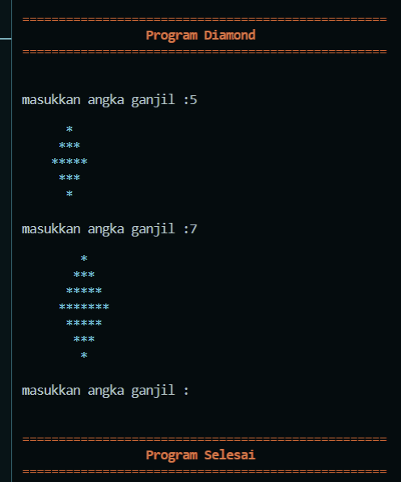
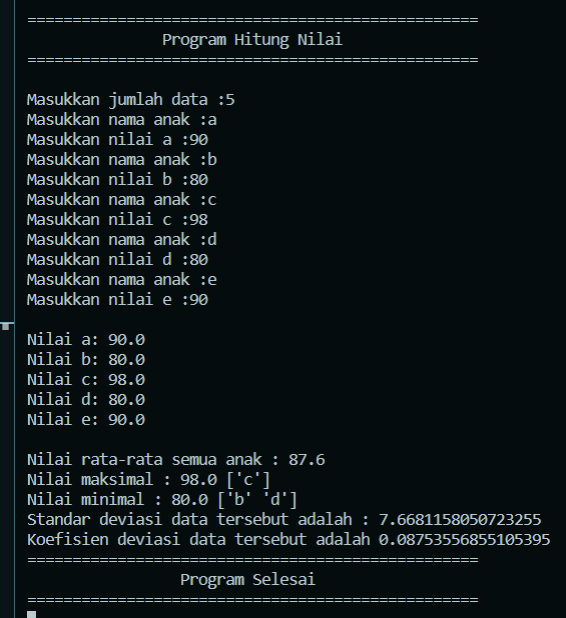
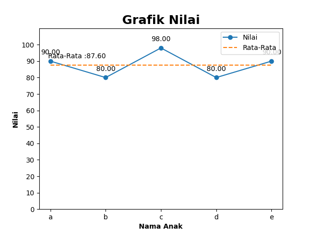

# Repo untuk Kumpulan Coding Iseng

## 1. Program Diamond/Belah Ketupat
Program untuk membuat bentuk diamond/belah ketupat dengan jumlah ganjil yang diinput oleh pengguna. Program dapat dijalankan secara berulang, dan cukup menekan enter untuk mengakhiri program



<details>
<summary>Code</summary>
Ditambahkan juga library rich untuk menambahkan sedikit warna pada terminal
  
```python
import math
import sys
from rich.console import Console

console = Console()

print("")
console.print("="*50,style="red")
teks = "Program Diamond"
console.print(teks.center(50),style="bold red")
console.print("="*50,style="red")
print("")

n = " "
while n != "":
    n = input("\nmasukkan angka ganjil :")
    print("")
    y = 1
    x = 0
    c = 4

    if n != "":
        for i in range(int(n)):
            if i < math.ceil(int(n)/2):
                console.print(" "*(int(n)-i),"*"*(y+x),style="cyan")
                y += 1
                x += 1
            else:
                console.print(" "*(x+1),"*"*(y+x-c),style="cyan")
                c += 4
                x += 1
                y += 1
    else:
        print("")
        console.print("="*50,style="red")
        teks = "Program Selesai"
        console.print(teks.center(50),style="bold red")
        console.print("="*50,style="red")
        print("")
        sys.exit()
```
</details>

## 2. Program Input Nilai
Program ini dapat digunakan untuk memasukkan nilai beserta nama dari n anak yang ditentukan oleh pengguna. Program akan menghasilkan :
- Nilai Rata-rata
- Nilai max dan min (beserta nama anaknya)
- Standar Deviasi
- Koefisien Deviasi
- Grafik nilai sederhana

Hasil pada terminal :



Hasil Grafik :



<details>
<summary>Code</summary>
  
```python
import numpy as np
import math

print("")
print("="*50)
end = "Program Hitung Nilai"
endCenter = end.center(50)
print(endCenter)
print("="*50)
print("")

data = []
dataNama = []
dataSD = []
n = float(input("Masukkan jumlah data :"))

i = 1
while i <= n:
    nama = input("Masukkan nama anak :")
    nilai = float(input("Masukkan nilai %s :"%nama))
    dataNama.append(nama)
    data.append(nilai)
    i += 1

print("")

i = 1
while i <= n:
    x = i - 1
    print("Nilai %s:"%dataNama[x],data[x])
    i += 1

rerata = sum(data) / n
nilaiMax = max(data)
nilaiMin = min(data)

for i in data:
    jarak = i-rerata
    jarakKuadrat = jarak ** 2
    dataSD.append(jarakKuadrat)

Std = sum(dataSD) / (n-1)
StandarDeviasi = math.sqrt(Std)
cv = StandarDeviasi/rerata

data_np = np.array(data)
dataNama_np = np.array(dataNama)

print("\nNilai rata-rata semua anak :",rerata)
nMax = np.max(data_np)
pnMax = np.where(data_np == nMax)
whoMax = dataNama_np[pnMax]
print("Nilai maksimal :", nilaiMax, whoMax)
nMin = np.min(data_np)
pnMin = np.where(data_np == nMin)
whoMin = dataNama_np[pnMin]
print("Nilai minimal :", nilaiMin,whoMin)
print("Standar deviasi data tersebut adalah :", StandarDeviasi)
print("Koefisien deviasi data tersebut adalah {}".format(cv))

print("="*50)
end = "Program Selesai"
endCenter = end.center(50)
print(endCenter)
print("="*50)

# Matplotlib
import matplotlib.pyplot as plt

x1 = dataNama_np
y1 = data_np

avg = [rerata]*len(x1)
x2 = dataNama_np
y2 = avg

plt.plot(x1,y1,"o-", label = "Nilai")
plt.plot(x2,y2,'--', label = "Rata-Rata")

plt.yticks([0,10,20,30,40,50,60,70,80,90,100])
axes = plt.gca()
axes.set_ylim([0,110])

for x,y in zip(x1,y1):
    label = "{:.2f}".format(y)
    plt.annotate(label,(x,y),textcoords = "offset points", xytext = (0,10), ha = "center")

plt.annotate("Rata-Rata :{:.2f}".format(rerata),(1,rerata),textcoords = "offset points", xytext = (0,10), ha = "right")

plt.title("Grafik Nilai", fontsize = 18, fontweight = "bold")
plt.xlabel("Nama Anak", fontweight = "bold")
plt.ylabel("Nilai", fontweight = "bold")
plt.legend()

plt.show()
```

</details>

## 3. Kode Spam
a) Spam dengan kata
<details>
<summary>Code</summary>
 
 ```python
 import pyautogui, time

time.sleep(5)

x = "ini spam"

for i in range(5):
    pyautogui.typewrite(x)
    pyautogui.press("enter")
 ```
  </details>
  
b) Spam dengan lirik
<details>
<summary>Code</summary>
 
 ```python
 import pyautogui, time

time.sleep(5)

baca = open("lirik.txt","r")

for i in baca:
    pyautogui.typewrite(i)
    pyautogui.press("enter")
 ```
  </details>
