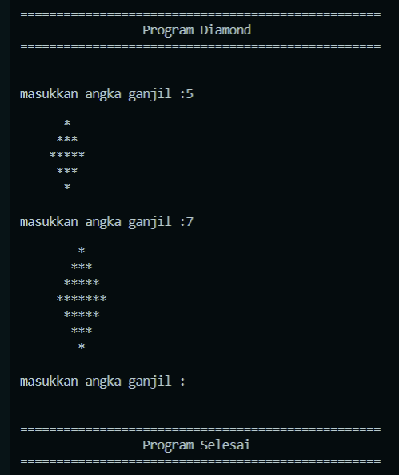

# Repo untuk Kumpulan Coding Iseng
### 1. Program Diamond/Belah Ketupat
Program untuk membuat bentuk diamond/belah ketupat dengan jumlah ganjil yang diinput oleh pengguna. Program dapat dijalankan secara berulang, dan cukup menekan enter untuk mengakhiri program

[Link](https://github.com/hafizadit/Iseng/blob/main/Diamond.py)
